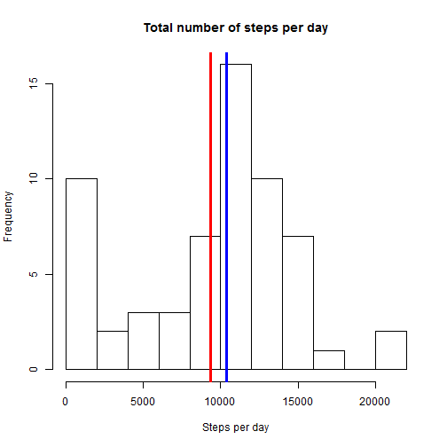
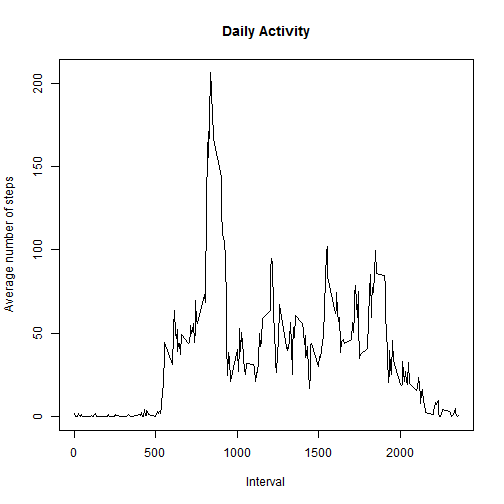
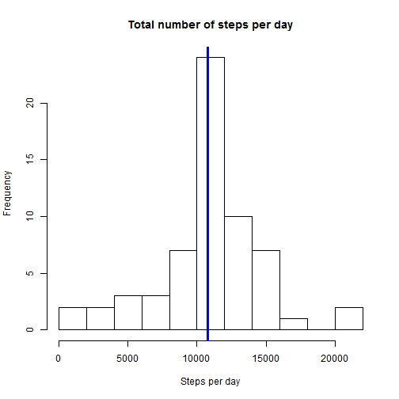
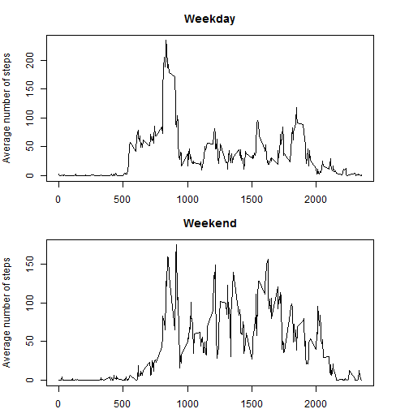

Reproducible research
======================
##Peer Assesment 1 
by Anastasia Urupa

### Introduction

It is now possible to collect a large amount of data about personal movement using activity monitoring devices such as a Fitbit, Nike Fuelband, or Jawbone Up. These type of devices are part of the Уquantified selfФ movement Ц a group of enthusiasts who take measurements about themselves regularly to improve their health, to find patterns in their behavior, or because they are tech geeks. But these data remain under-utilized both because the raw data are hard to obtain and there is a lack of statistical methods and software for processing and interpreting the data.

This assignment makes use of data from a personal activity monitoring device. This device collects data at 5 minute intervals through out the day. The data consists of two months of data from an anonymous individual collected during the months of October and November, 2012 and include the number of steps taken in 5 minute intervals each day

### Data

The data for this assignment can be downloaded from the course web site:

- Dataset: [Activity monitoring data](https://d396qusza40orc.cloudfront.net/repdata%2Fdata%2Factivity.zip)

The variables included in this dataset are:

- steps: Number of steps taking in a 5-minute interval (missing values are coded as NA)

- date: The date on which the measurement was taken in YYYY-MM-DD format

- interval: Identifier for the 5-minute interval in which measurement was taken

The dataset is stored in a comma-separated-value (CSV) file and there are a total of 17,568 observations in this dataset.

### Loading and preprocessing the data


```r
data<-read.csv("C:/Users/Ќаст€/Documents/R/repdata-data-activity/activity.csv", stringsAsFactors=F)
data$date<-as.Date(data$date, format="%Y-%m-%d")
data$index<-seq(along=data$steps)
summary(data)
```

```
##      steps            date               interval        index      
##  Min.   :  0.0   Min.   :2012-10-01   Min.   :   0   Min.   :    1  
##  1st Qu.:  0.0   1st Qu.:2012-10-16   1st Qu.: 589   1st Qu.: 4393  
##  Median :  0.0   Median :2012-10-31   Median :1178   Median : 8784  
##  Mean   : 37.4   Mean   :2012-10-31   Mean   :1178   Mean   : 8784  
##  3rd Qu.: 12.0   3rd Qu.:2012-11-15   3rd Qu.:1766   3rd Qu.:13176  
##  Max.   :806.0   Max.   :2012-11-30   Max.   :2355   Max.   :17568  
##  NA's   :2304
```

### What is mean total number of steps taken per day?

Histogram of the total number of steps taken each day:


```r
dailySum<-tapply(data$steps, data$date, sum, na.rm=T)
hist(dailySum, breaks=15, main="Total number of steps per day", xlab="Steps per day")
abline(v=mean(dailySum), col="red", lwd=3)
abline(v=median(dailySum), col="blue", lwd=3)
```

 

Mean of total number of steps taken each day:

```r
mean(dailySum)
```

```
## [1] 9354
```

Median of total number of steps taken each day:

```r
median(dailySum)
```

```
## [1] 10395
```

### What is the average daily activity pattern?

Average number of steps in each 5-minute interval:


```r
intervalMean<-tapply(data$steps, data$interval, mean, na.rm=T)
plot(unique(data$interval), intervalMean, type="l", main="Daily Activity", 
     xlab="Interval", ylab="Average number of steps")
```

 

5-minute interval with maximum average number of steps:

```r
unique(data$interval)[seq(along=intervalMean)[intervalMean==max(intervalMean)]]
```

```
## [1] 835
```

### Imputing missing values

Number of missing values:


```r
sum(!complete.cases(data))
```

```
## [1] 2304
```

Imputing missing values with the mean for that 5-minute interval:


```r
imeans<-cbind(unique(data$interval), intervalMean)
imeans<-data.frame (imeans)
datameans<-merge(data, imeans, by.x="interval", by.y="V1")
datameans<-datameans[order(datameans$index),]
dataNoNa<-data
dataNoNa$steps[is.na(dataNoNa$steps)]<-datameans$intervalMean[datameans$index %in% dataNoNa$index[is.na(dataNoNa$steps)]]
```

Histogram of total number of steps per day for dataset with imputed values:

```r
dailySum1<-tapply(dataNoNa$steps, dataNoNa$date, sum, na.rm=T)
hist(dailySum1, breaks=15, main="Total number of steps per day", xlab="Steps per day")
abline(v=mean(dailySum1), col="red", lwd=3)
abline(v=median(dailySum1), col="blue", lwd=3)
```

 

Mean of total number of steps taken each day for dataset with imputed values:

```r
mean(dailySum1)
```

```
## [1] 10766
```

Median of total number of steps taken each day for dataset with imputed values:

```r
median(dailySum1)
```

```
## [1] 10766
```

As we can see from the figures above, imputing NAs changes the histogram considerably. Missing values lower total number of steps taken each day, and therefore median and mean too.

### Are there differences in activity patterns between weekdays and weekends?

Creating factor variable with 2 levels: "weekday" and "weekend":


```r
weekday<-weekdays(data$date)
weekday[weekday %in% c("понедельник", "вторник","среда","четверг","п€тница")]<-"weekday"
weekday[weekday %in% c("суббота", "воскресенье")]<-"weekend"
data$weekday<-as.factor(weekday)
```


```r
data1<-data[data$weekday=="weekday",]
data2<-data[data$weekday=="weekend",]
intervalMean1<-tapply(data1$steps, data1$interval, mean, na.rm=T)
intervalMean2<-tapply(data2$steps, data2$interval, mean, na.rm=T)
par(mfrow=c(2,1),mar=c(2,4,3,3))
plot(unique(data1$interval), intervalMean1, type="l", main="Weekday", xlab="Interval", ylab="Average number of steps")
plot(unique(data2$interval), intervalMean2, type="l", main="Weekend", xlab="Interval", ylab="Average number of steps")
```

 
